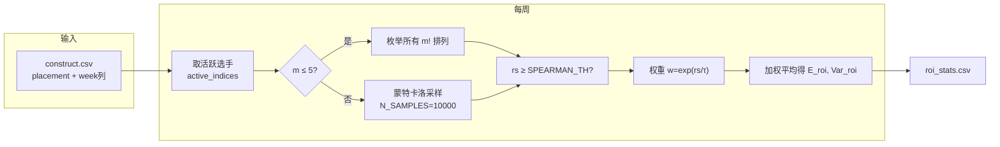
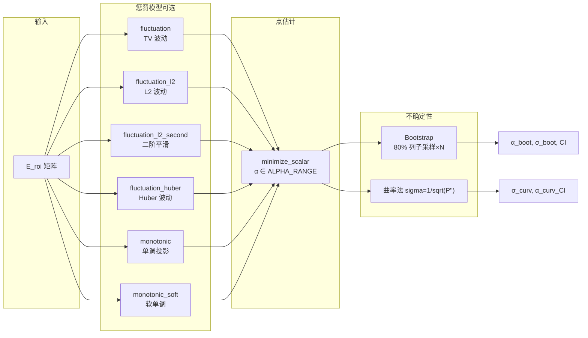

# 美赛 C 题：全流程数学模型与方法说明

本文档汇总从原始数据到粉丝占比 pq 的**完整流程**、**所有数学模型**及**各模块具体方法**，并配有 Mermaid 流程图。

**显示说明**：公式使用 `$...$`（行内）与 `$$...$$`（块级），流程图使用 Mermaid。请在支持 **KaTeX/MathJax** 与 **Mermaid** 的 Markdown 预览中打开（如 VS Code 安装 “Markdown Preview Mermaid Support”、Typora、GitHub、Obsidian 等），否则公式或流程图可能显示为源码。

---

## 一、整体流程概览

```mermaid
flowchart TB
    subgraph INPUT["输入"]
        A0[2026_MCM_Problem_C_construct.csv]
    end

    subgraph STEP1["Step 1: ROI 统计量"]
        A1[constructm.py]
        A2[roi_stats.csv]
        A1 --> A2
    end

    subgraph STEP2["Step 2: alpha 参数拟合"]
        B1[fit_alpha.py]
        B2[alpha_params_full.csv]
        B1 --> B2
    end

    subgraph STEP3["Step 3: pq 计算与置信区间"]
        C1{"赛季类型?"}
        C2[reflectrank.py<br/>roi = rw + rq]
        C3[reflectpq.py<br/>roi = rank(pw+pq)]
        C4[pq_season_X.csv]
        C1 -->|Season 1-2, 29-34| C2
        C1 -->|Season 3-28| C3
        C2 --> C4
        C3 --> C4
    end

    A0 --> A1
    A2 --> B1
    A2 --> C2
    A2 --> C3
    B2 --> C2
    B2 --> C3
```

**运行入口**：`python runall.py`（或 `run_all.py`），依次执行 Step 1 → Step 2 → Step 3，输出到 `output_all/`。

---

## 二、Step 1：ROI 统计量（constructm.py）

**目标**：对每个赛季、每一周，计算每位活跃选手的 **E[roi]** 和 **Var[roi]**，并输出 `roi_stats.csv`。

### 2.1 数学模型

- **roi**：选手在该周「综合排名」的随机变量（1=最好，m=最差）。
- 只考虑与**最终名次 placement** 有一定相关性的排名排列，用 **Spearman 相关系数** 衡量，再按相关性加权平均得到 E[roi] 和 Var[roi]。

**公式**：

$$
E[\text{roi}_i] = \frac{\sum_{\text{perm}} w_{\text{perm}} \cdot \text{rank}_i(\text{perm})}{\sum_{\text{perm}} w_{\text{perm}}}, \quad
w_{\text{perm}} = \exp\left(\frac{r_s}{\tau}\right)
$$

其中：

- $\text{perm}$：当周活跃的 $m$ 名选手的一个排名排列（1～m）。
- $\text{rank}_i(\text{perm})$：选手 $i$ 在该排列中的名次。
- $r_s = \text{Spearman}(\text{full\_perm}, \text{placement})$：该排列与**最终 placement** 的 Spearman 相关系数。
- $\tau = \text{SOFTMAX\_TEMP}$（如 0.2）：权重陡度，越小则高 $r_s$ 的排列权重越大。

**方差**：$E[\text{roi}^2]$ 用同样权重加权平均得到，再 $\text{Var}[\text{roi}] = E[\text{roi}^2] - (E[\text{roi}])^2$。

### 2.2 计算流程（流程图）



### 2.3 关键参数（config.py）

| 参数 | 含义 | 典型值 |
|------|------|--------|
| MAX_ENUM | m ≤ 该值时枚举所有 m! 排列 | 5 |
| MAX_SAMPLE / N_SAMPLES | m > MAX_ENUM 时蒙特卡洛采样数 | 10000 |
| SPEARMAN_TH | 与最终名次 Spearman 阈值，低于则丢弃排列 | 0.5 |
| SOFTMAX_TEMP (τ) | 权重 $e^{r_s/\tau}$ 的陡度 | 0.2 |

### 2.4 基准列

最后一列「基准 placement 列」：每位选手的 roi = placement，Var_roi = 0，用于后续反推。

---

## 三、Step 2：α 参数拟合（fit_alpha.py）

**目标**：为每个赛季估计**指数衰减参数 α** 及其不确定性（标准差、置信区间），输出 `alpha_params_full.csv`。  
α 用于「排名 → 粉丝占比」的转换：$pq_i \propto \exp(-\alpha (r_i - 1))$。

本步包含两类**子模型**：

1. **α 点估计**：在给定**惩罚函数**下最小化惩罚，得到最优 α（内部可选多种惩罚类型）。
2. **不确定性估计**：**Bootstrap 法** 得到 α 的分布与置信区间；**曲率法** 在最优 α 处用惩罚函数的二阶导数估计标准差 σ。

下面分别写「惩罚函数（多模型）」「Bootstrap」「曲率法」，再给总流程图。

### 3.1 从 α 到 pq 的中间量

给定某周 $E_{\text{roi}}$ 矩阵（行=该赛季所有周，列=选手），对任意 α：

$$
\text{scores}_{ij} = \exp\bigl(-\alpha (E_{\text{roi},ij} - 1)\bigr), \quad
pq_{ij} = \frac{\text{scores}_{ij}}{\sum_j \text{scores}_{ij}}
$$

即先按指数衰减把「期望排名」变成得分，再按行归一化为占比 pq。**惩罚函数** 只依赖由该 α 得到的 pq 矩阵（按行归一化后），用来衡量 pq 的「不合理程度」；拟合时最小化该惩罚以选 α。

### 3.2 惩罚函数（PENALTY_TYPE：多模型）

**配置**：`config.PENALTY_TYPE` 可选：`fluctuation`、`fluctuation_l2`、`fluctuation_l2_second`、`fluctuation_huber`、`monotonic`、`monotonic_soft`。当前默认：`fluctuation_huber`。

所有惩罚都是**标量**，对「该赛季、该 α 下」的 pq 矩阵计算，**越小越好**；α 的拟合 = 在 $\alpha\in[\alpha_{\min},\alpha_{\max}]$ 上最小化该惩罚。

| 类型 | 名称 | 数学形式 | 含义 |
|------|------|----------|------|
| **fluctuation** | TV 波动 | $\sum_{t,j} \|pq_{t+1,j} - pq_{t,j}\|$ | 相邻周 pq 变化 L1，抑制剧烈波动 |
| **fluctuation_l2** | L2 波动 | $\sum_{t,j} (pq_{t+1,j} - pq_{t,j})^2$ | 相邻周 pq 变化 L2，可微、方差较小 |
| **fluctuation_l2_second** | 二阶平滑 | $\sum_{t,j} (\Delta^2 pq_{t,j})^2$，$\Delta^2 pq = pq_{t+2} - 2pq_{t+1} + pq_t$ | 惩罚曲率，鼓励更线性、平滑 |
| **fluctuation_huber** | Huber 波动 | $\sum_{t,j} h(pq_{t+1,j} - pq_{t,j}; \delta)$，$h(d;\delta)$ 为 Huber 损失 | 小变化用 L2、大变化用 L1，鲁棒且可微（$\delta$ 如 0.01） |
| **monotonic** | 单调投影 | 对每位选手 j，其 pq 序列与「最优单调拟合」的 L1 距离之和；单调分递增/递减两种，取 min | 鼓励每位选手的 pq 随周单调（增或减） |
| **monotonic_soft** | 软单调 | 同上，但用 $\mathrm{softmin}(L1_{\uparrow}, L1_{\downarrow}) = -\tau\ln(e^{-L1_{\uparrow}/\tau}+e^{-L1_{\downarrow}/\tau})$ 代替 min | 平滑可微，Bootstrap 时方差更小 |

- **fluctuation 系列**：按**时间（周）**维度看 pq 的平滑度。  
- **monotonic 系列**：按**选手**维度，每条选手的 pq 序列与单调序列的偏差（单调拟合用 sklearn 的 IsotonicRegression）。

### 3.3 α 点估计（单次优化）

- **决策变量**：$\alpha \in [\alpha_{\min}, \alpha_{\max}]$（如 config 中 ALPHA_RANGE = (0.1, 2.0)）。
- **目标**：最小化 $P(\alpha) = \text{Penalty}(\text{pq}(\alpha))$，其中 pq 由 3.1 中公式由 E_roi 与 α 得到。
- **方法**：`scipy.optimize.minimize_scalar`，bounds 为 ALPHA_RANGE，method=`'bounded'`。

即：**一个模型 = 一个惩罚类型 + 有界一维最小化**。

### 3.4 Bootstrap 法（α 的分布与置信区间）

- 对当前赛季的 E_roi 矩阵，重复 $N$ 次（如 N_BOOTSTRAP=100）：
  - 随机抽取 80% 的**选手列**（replace=False），得到子矩阵。
  - 对该子矩阵做**一次**上述 α 点估计（同一惩罚类型），得到 $\alpha^{(b)}$。
- 用这 $N$ 个 $\alpha^{(b)}$ 计算：
  - $\alpha_{\text{boot}}$ = mean，$\sigma_{\text{boot}}$ = std；
  - 95% 置信区间：2.5% 与 97.5% 分位数。
- 若选手数 < 3 或 Bootstrap 有效样本 < 10，则退化为单次点估计，并给一个默认 σ（如 0.1）和区间宽度（如 ±0.2）。

### 3.5 曲率法（σ 的另一种估计）

- 在已得到的**最优 α**（如 $\alpha_{\text{boot}}$）处，用**数值二阶导数**估计惩罚函数在 α 处的曲率：
  - $P(\alpha+\delta)$、$P(\alpha)$、$P(\alpha-\delta)$，$\delta=0.01$；
  - $P'' \approx (P(\alpha+\delta) - 2P(\alpha) + P(\alpha-\delta)) / \delta^2$。
- 若 $P''>0$，取 $\sigma_{\text{curv}} = 1/\sqrt{P''}$，并裁剪到 [0.01, 1.0]；否则用默认 0.1。
- 曲率法只用来得到**标准差**（及由 α ± 1.96σ 得到的区间），**不改变 α 的点估计**；α 的点估计仍来自 Bootstrap（或单次优化）。

### 3.6 α 计算中的「多模型」选择流程图



**说明**：实际运行时仅使用 config 中配置的**一种** PENALTY_TYPE，上图表示「可选模型」与「点估计 → Bootstrap / 曲率」的流程关系。

### 3.7 Step 2 总流程图

```mermaid
flowchart TB
    subgraph 输入
        E1[roi_stats.csv]
        E2[construct.csv]
    end

    subgraph 每赛季
        E3[构造 E_roi 矩阵]
        E4[Bootstrap: 80% 列子矩阵]
        E5[对子矩阵最小化惩罚 P(α)]
        E6[收集 α 样本 → α_boot, σ_boot, CI]
        E7[曲率法: P'' 估计 σ_curv]
        E8[写出 α_boot, σ_boot, α_curv, σ_curv 等]
    end

    subgraph 惩罚模型
        P1[PENALTY_TYPE]
        P2[fluctuation / L2 / L2二阶 / Huber]
        P3[monotonic / monotonic_soft]
        P1 --> P2
        P1 --> P3
    end

    E1 --> E3
    E2 --> E3
    E3 --> E4
    E4 --> E5
    E5 --> P1
    E5 --> E6
    E6 --> E7
    E7 --> E8
    E8 --> E9["alpha_params_full.csv"]
```

---

## 四、Step 3：pq 计算与置信区间（reflectpq / reflectrank）

根据**赛季类型**选用不同**结构模型**：

- **Type 1 / 3**（Season 1–2, 29–34）：**roi = rw + rq** → 使用 `reflectrank.py`。
- **Type 2**（Season 3–28）：**roi = rank(pw + pq)** → 使用 `reflectpq.py`。

两者共同点：都用**截断正态**从 E、Var 反推 (μ, σ)，再用 **μ → pq** 的指数映射 + 蒙特卡洛采样得到 pq 的分布与 95% 置信区间。

### 4.1 通用：截断正态 (μ, σ) 反推

已知某随机变量（roi 或 rq）的 **E** 和 **Var**，支持区间 $[1, m]$，假设其服从截断正态 $X \sim \text{TruncNorm}(1, m; \mu, \sigma)$。  
由截断正态的期望、方差公式反解 (μ, σ)：

- 设 $a=(1-\mu)/\sigma$，$b=(m-\mu)/\sigma$，$Z=\Phi(b)-\Phi(a)$，$\phi$ 为标准正态 PDF。
- $E = \mu + \sigma \frac{\phi(a)-\phi(b)}{Z}$，$\text{Var} = \sigma^2\left(1 + \frac{a\phi(a)-b\phi(b)}{Z} - \left(\frac{\phi(a)-\phi(b)}{Z}\right)^2\right)$。
- 用 `scipy.optimize.fsolve` 解 $(E_{\text{calc}}-E, \text{Var}_{\text{calc}}-\text{Var})=0$ 得到 (μ, σ)。若 Var 过小或求解失败，则用 $\sigma \ge \text{TRUNCNORM\_SIGMA\_MIN}$ 等默认策略。

### 4.2 Type 1/3：roi = rw + rq（reflectrank.py）

**结构**：综合排名 roi = 评委排名 rw + 粉丝排名 rq（数值加法）。

**步骤简述**：

1. 从 construct 的 week 列得到该周**评委占比**，按占比从高到低得到 **rw**（1～m）。
2. 由 roi 统计量得 **E_roi, Var_roi**；关系 roi = rw + rq ⇒ rq = roi − rw，故：
   - $E[\text{rq}]_i = E[\text{roi}]_i - \text{rw}_i + \text{offset}$，其中 offset 使 $\sum_i E[\text{rq}]_i = m(m+1)/2$（保持与排名一致的中心）；
   - $\text{Var}[\text{rq}] \approx \text{Var}[\text{roi}]$。
3. 对每个选手用 4.1 从 (E_rq, Var_rq) 反推 (μ, σ)。
4. **蒙特卡洛**：对 α 从 $N(\alpha_{\text{boot}}, \sigma_{\text{boot}})$ 抽样，对 rq 从各选手的截断正态抽样，再：
   - $\text{score}_i = \exp(-\alpha (\text{rq}_i - 1))$，pq = score / sum(score)。
5. 对每位选手的 pq 样本求均值、标准差、2.5% 与 97.5% 分位数，得到 pq 期望与 95% 置信区间。

### 4.3 Type 2：roi = rank(pw + pq)（reflectpq.py）

**结构**：综合排名 = 对「评委占比 pw + 粉丝占比 pq」做排名（rank），因此观测到的是**排名**，而不是 pw+pq 本身；模型里用 E_roi 作为「排名」的期望，再反推 pq。

**步骤简述**：

1. 从 construct 得到该周 **pw**（评委占比，已按活跃选手归一化）。
2. 该周 **E_roi, Var_roi** 来自 roi_stats（同上）。
3. 把 E_roi 视作「综合排名」的期望，用**同一套截断正态反推**得到 (μ, σ)（在 reflectpq 里是对 roi 的分布反推 μ, σ；若代码里变量名叫 μ，语义上对应「排名」的分布参数）。
4. **蒙特卡洛**：对 α 和 roi 分别抽样（roi 用截断正态），再：
   - \(\text{score}_i = \exp(-\alpha (\text{roi}_i - 1))\)，pq = score / sum(score)。
5. 同样对每位选手的 pq 样本求均值、标准差与 2.5%/97.5% 分位数，得到 pq 期望与 95% CI。

### 4.4 μ → pq 的公式（两脚本共用）

对一组「排名」或「rq」的取值 $r_1,\ldots,r_m$（或其抽样）：

$$
\text{score}_i = \exp\bigl(-\alpha (r_i - 1)\bigr), \quad
pq_i = \frac{\text{score}_i}{\sum_j \text{score}_j}
$$

α 越大，排名靠前（r 小）的选手占比越大；α 来自 Step 2 的 `alpha_params_full.csv`（通常用 α_boot, σ_boot）。

### 4.5 Step 3 流程图

```mermaid
flowchart TB
    subgraph 输入
        F1[roi_stats.csv]
        F2[alpha_params_full.csv]
        F3[construct.csv]
    end

    subgraph 按周
        F4{"赛季类型"}
        F5[reflectrank: rw, E_rq, Var_rq]
        F6[reflectpq: pw, E_roi, Var_roi]
        F7[截断正态反推 (μ,σ)]
        F8[蒙特卡洛: α, roi/rq 抽样 → pq 样本]
        F9[CI: mean, std, 2.5%, 97.5%]
    end

    F1 --> F4
    F2 --> F8
    F3 --> F5
    F3 --> F6
    F4 -->|1-2, 29-34| F5
    F4 -->|3-28| F6
    F5 --> F7
    F6 --> F7
    F7 --> F8
    F8 --> F9
    F9 --> F10["pq_season_X.csv"]
```

---

## 五、α 计算中的「多模型」小结

| 层级 | 模型/方法 | 含义 |
|------|-----------|------|
| **惩罚类型** | fluctuation | TV(L1) 时间波动 |
| | fluctuation_l2 | L2 时间波动 |
| | fluctuation_l2_second | 二阶差分平滑 |
| | fluctuation_huber | Huber 时间波动（默认） |
| | monotonic | 每位选手 pq 与单调拟合的 L1，取 min(增,减) |
| | monotonic_soft | 同上，用 softmin 平滑 |
| **α 点估计** | 有界一维最小化 | 在 ALPHA_RANGE 上最小化上述某一惩罚 |
| **不确定性** | Bootstrap | 80% 列子采样 + 重复优化 → α 的均值和 95% CI |
| **不确定性** | 曲率法 | 在最优 α 处用 $P''$ 估计 σ，得到 σ_curv 及区间 |

输出 `alpha_params_full.csv` 中同时包含 Bootstrap 与曲率两套结果（α_boot/σ_boot、α_curv/σ_curv 等）；下游 pq 计算时由 config 的 `ALPHA_METHOD` 选择使用 `boot` 或 `curv`。

---

## 六、文件与脚本对应关系

| 文件/脚本 | 作用 | 主要输出 |
|-----------|------|----------|
| 2026_MCM_Problem_C_construct.csv | 原始构造数据（placement、week 列等） | - |
| config.py | 全局参数（惩罚类型、α 范围、Bootstrap 次数、置信水平等） | - |
| constructm.py | Step 1：E_roi, Var_roi | roi_stats.csv |
| fit_alpha.py | Step 2：α 拟合 + Bootstrap + 曲率 | alpha_params_full.csv |
| reflectrank.py | Step 3（Type 1/3）：roi = rw + rq → pq | pq_season_X.csv |
| reflectpq.py | Step 3（Type 2）：roi = rank(pw+pq) → pq | pq_season_X.csv |
| runall.py / run_all.py | 串联 Step 1→2→3，按赛季类型分发 | output_all/ 或分目录 |

若你希望把「α 的多种惩罚模型」在论文里画成一张总表或子流程图，可以直接从第三节和第五节抽取对应行与流程图使用。
